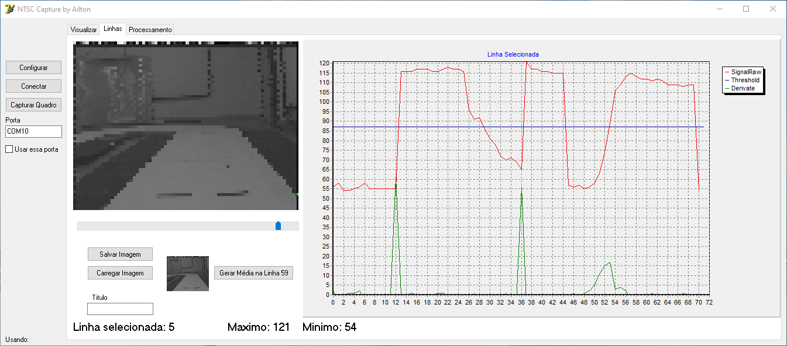
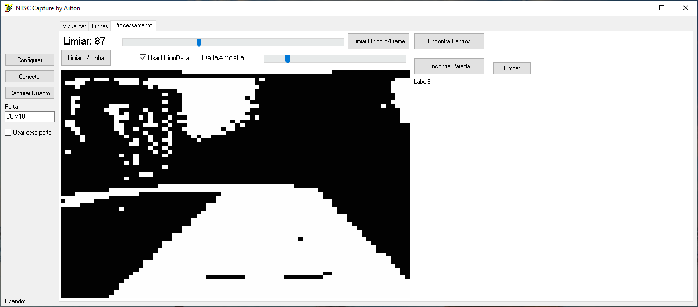

# Smartcar with CMOS camera

Source code using OV5116 CMOS monochrome camera from Freescale Cup Brazil 2015.

## CodeWarrior Projects Requirements

- CodeWarrior for MCU 10.6
- Freedom Board (Freescale Processor Kinetis KL25Z)
- FRDM-TFC Board
- OV5116 CMOS Sensor

## Delphi Projects Requirements

- Delphi 7
- ComPort Library version 3.0

### Screenshots

Version 3

Version 1
